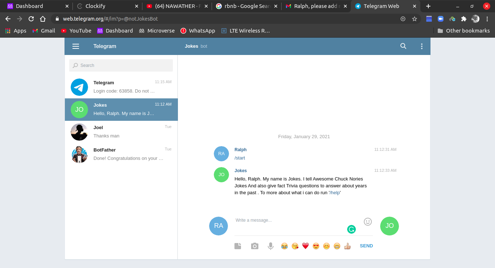

# Telegram_bot

 > In this project, I built a Telegram Bot that asks random trivia questions based on facts that happened in the past. It also sends you a random Chuck Norris joke every time you type in the command /joke. The main goal is to make a massive use of external API`s by putting into practice the main concepts of Object Oriented Programming, classes, modules, objects and accessing their attributes.
The project is built using the TDD technique.

## How to find the bot on Telegram
- To find the bot on Telegram, simply download the [desktop](https://telegram.org/) application and on mobile got to the play store (for andriod) and search for telegram or apple store(for ISO) and download the application.
- Create a Telegram account and simply search for the Bot with the username `@notJokesBot`.
- Run the command to `/start` and enjoy using the bot.
- Click this [link!](https://web.telegram.org/#/im?p=@notJokesBot) to use the bot on the Browser.
## You can see a short demo of the Bot /start command in the screenshot below.

## The available commands in the telegram bot
- `/start` receive a greetings message.
- `/joke`  receive random Chuck Norris joke.
- `/trivia` receive trivia question.
- `/help`  receive help on commands.
- `/about`  receive info about the creator.

## Built with

- Ruby
- [Chuck Norris API](https://matchilling-chuck-norris-jokes-v1.p.rapidapi.com/jokes/random)
- [Telegram API](https://core.telegram.org/api)
- [Numbers api](https://numbersapi.p.rapidapi.com/1492/year?fragment=true&json=true)
- RSpec
- Rubocop

## Prerequisities

To get this project up and running locally, you must have [Ruby](https://www.ruby-lang.org/en/downloads/) installed on your computer.

**To get this project set up on your local machine, follow these simple steps:**

**Step 1** 
Navigate through the local directory where you want to clone the repository and run 
`git clone https://github.com/Ralph-1/Telegram_bot.git`. 
**Step 2** 
Run `cd Telegram_bot` 
**Step 3** 
Change to the branch with the bot using `git checkout Telegram_bot` 
**Step 4** 
Run `bundle install` to install the gems from the `Gemfile`. 
**Step 5** 
Run `ruby bin/main.rb` to start the bot. 
**Step 6** 
You can use the commands defined in the Available commands section defined above. 

## Repository Contents

The code for the project is divided into the following directories: **./bin**, **./lib**, and **./spec**.

The **./bin** folder contains the executable **main.rb** file.

The **./lib** folder contains subsidiary files that set up all of the classes and methods used in bin/main.rb

- **jokes.rb**, where the jokes api is.
- **facts.rb**, where the random facts api.
- **random.rb**, the randow method can be found here which is reuable.

The **./spec** folder contains all the relative spec tests

- **random_spec.rb**, where the tests for the methods are defined.
- **spec_helper.rb**, initial file generated by the RSpec.

In addition to the above, the repo also contains .rubocop.yml for linting.

## Tests

1. Open Terminal

2. Install RSpec on your system by running:

   `gem install rspec`

3. Run the tests with the command:

   `rspec`

## Authors

👤 **Ralph Oburu**

- Github: [Ralph-1](https://github.com/Ralph-1)
- Twitter: [@NotRalph0](https://twitter.com/NotRalph0)
- Linkedin: [Ralph](https://www.linkedin.com/in/ralph-oburu-092a561b1/)

## 🤝 Contributing

Feel free to check the [issues page](https://github.com/Ralph-1/Telegram_bot/issues) to either create an issue or help us out by fixing an existing one.

## Show your support

If you like this project please give it a ⭐️!

## 📝 License

This project is licensed by Microverse and [MIT]